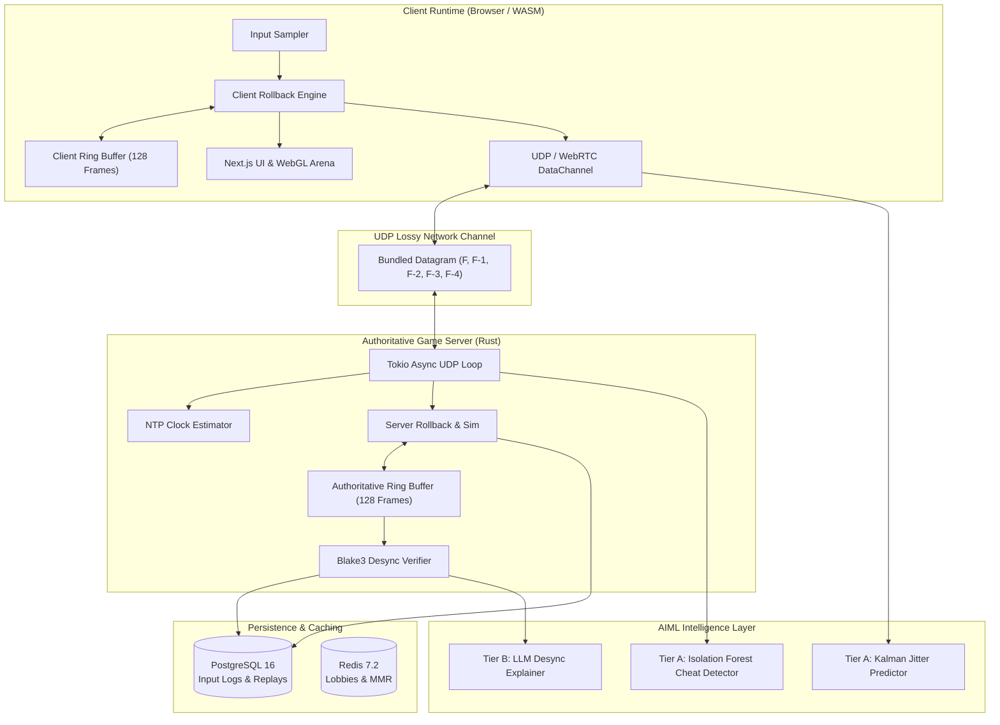

# Rollback Netcode Server & Deterministic 2D Arena

[](https://github.com/AVISHJAIN9/rollback-netcode-server/actions/workflows/ci.yml)
[](LICENSE)
[](#status)

A production-grade, server-authoritative multiplayer netcode engine and client runtime with client-side prediction, snapshot ring buffers, sub-millisecond rollback resimulation, UDP redundant input bundling, Blake3 continuous state checksumming, and integrated Machine Learning operations (unsupervised cheat detection, Kalman jitter prediction, and LLM desync root-cause analysis).

---

## Table of Contents
1. [Executive Overview](#1-executive-overview)
2. [End-to-End System Flows & User Journeys](#2-end-to-end-system-flows--user-journeys)
3. [Architecture & Component Breakdown](#3-architecture--component-breakdown)
4. [Deterministic Physics & Fixed-Point Arithmetic (Q16.16)](#4-deterministic-physics--fixed-point-arithmetic-q1616)
5. [Snapshot Circular Ring Buffer & Memory Layout](#5-snapshot-circular-ring-buffer--memory-layout)
6. [Rollback Resimulation Engine](#6-rollback-resimulation-engine)
7. [UDP Binary Protocol & Redundant Packet Bundling](#7-udp-binary-protocol--redundant-packet-bundling)
8. [Clock Synchronization & Jitter Buffer Estimation](#8-clock-synchronization--jitter-buffer-estimation)
9. [Blake3 State Checksumming & Desync Forensics](#9-blake3-state-checksumming--desync-forensics)
10. [AIML Subsystem (Tier A & Tier B)](#10-aiml-subsystem-tier-a--tier-b)
11. [Database Schema & In-Memory State](#11-database-schema--in-memory-state)
12. [Frontend Architecture & Visualization Engine](#12-frontend-architecture--visualization-engine)
13. [Security, Threat Modeling & Failure Modes](#13-security-threat-modeling--failure-modes)
14. [Testing & Verification Suite](#14-testing--verification-suite)
15. [Benchmark Plan & Performance Targets](#15-benchmark-plan--performance-targets)
16. [Deployment & Infrastructure](#16-deployment--infrastructure)
17. [Requirements Traceability Matrix](#17-requirements-traceability-matrix)
18. [Unknowns & TO BE MEASURED Register](#18-unknowns--to-be-measured-register)

---

## 1. Executive Overview [Specified]
In multiplayer real-time network gaming, latency is the ultimate barrier to fluid, responsive interaction. Traditional lockstep architectures freeze simulation progress until all remote peer inputs are acknowledged, introducing input lag proportional to round-trip latency. Naive client-side prediction architectures suffer from visual jitter and severe desynchronization when client approximations diverge from authoritative server results.

`rollback-netcode-server` implements a deterministic, server-authoritative netcode model with client-side rollback prediction. Local inputs are sampled and applied immediately on the current simulation frame without waiting for server confirmation. When delayed remote inputs or authoritative server updates arrive out-of-order, the engine restores a historical snapshot from a circular ring buffer, applies the confirmed inputs, and fast-forwards the simulation back to the current frame in sub-millisecond time.

### Status Tagging Conventions
- `[Specified]`: Architectural design and technical specification complete.
- `[Scaffolded]`: Interfaces, data structures, and method stubs defined with strict typed signatures and `NotImplemented` guards.
- `[Implemented]`: Fully executable logic written and integrated.
- `[Verified]`: Validated via automated test suites and benchmarks.

---

## 2. End-to-End System Flows & User Journeys [Specified]

### 2.1 Player Authentication & Matchmaking Flow
1. **Landing & Login**: The user navigates to `/`. The top navigation bar displays `[Home]`, `[Dashboard]`, `[Arena]`, `[AI Diagnostics]`, and a `[Sign In with Google]` button.
2. **OAuth2 Exchange**: Clicking `Sign In with Google` redirects to Google OAuth2. Upon consent, Google returns an authorization code to `/api/auth/callback/google`. The backend exchanges the code for identity tokens, provisions or loads the player account in PostgreSQL, issues a signed JWT session cookie, and redirects to `/dashboard`.
3. **Queue Ingress**: From `/arena`, the player clicks `Find Match`. The client issues an authenticated HTTPS POST to `/api/v1/match/queue` with player MMR and measured region latency.
4. **Redis Matchmaking Engine**: The matchmaking worker places the player ticket into a Redis Sorted Set keyed by region and MMR bracket (`matchmaking:queue:us-east:1400-1600`).
5. **Room Allocation**: When two compatible peers are paired, the worker generates an authoritative match room, allocates an isolated UDP server port (e.g. `9002`), writes room metadata into Redis (`session:{id}:meta`), and returns the connection token to both clients.

### 2.2 Gameplay Network & Rollback Resimulation Flow
1. **UDP Handshake**: The client opens a non-blocking UDP socket and transmits a `PacketHeader` with its `session_token`. The server validates the token and registers the client's socket address in its peer table.
2. **Deterministic Frame Loop (60 Hz)**:
   - At each 16.666 ms tick, the client samples local input hardware (e.g. stick delta, attack button).
   - The local input is applied immediately to the local `WorldState` at frame $F_{current}$.
   - The updated `WorldState` and its 64-bit Blake3 hash are pushed into slot $(F_{current} \pmod{128})$ of the client's `RingBuffer`.
   - The client constructs a UDP datagram bundling current input $F_{current}$ along with redundant history frames $F_{current}-1, F_{current}-2, F_{current}-3, F_{current}-4$ and the checksum of frame $F_{current}-1$, transmitting it to the server.
3. **Server Ingestion & Reconciliation**:
   - The server UDP loop reads the datagram, unpacks inputs, and stores them in the authoritative input queue.
   - If a client packet was delayed in transit and arrives at server frame $F_{server}=105$ but contains inputs for frame $F_{client}=98$, the server's rollback engine triggers:
     1. State is rewound to the snapshot at frame 98.
     2. The confirmed input is inserted into the authoritative history.
     3. The server steps deterministic physics for frames $98 \to 105$.
     4. Updated snapshots are written to the authoritative ring buffer.
   - The server broadcasts an authoritative state confirmation datagram to all peers.
4. **Client Desync Detection**:
   - If the client's computed checksum for frame 98 differs from the server's authoritative checksum, the client flags a desynchronization event, halts local prediction, requests an authoritative state snap, and posts forensic diffs to `/api/v1/ai/explain-desync`.

---

## 3. Architecture & Component Breakdown [Specified]



### Component State & Concurrency Model
| Component | Primary Responsibility | Data Structures | Concurrency Model | Failure Behavior |
| :--- | :--- | :--- | :--- | :--- |
| **FixedPointMath** | Bit-exact math operations | `FixedI32` (struct around `i32`) | Pure functions, zero state | Arithmetic clamp on overflow |
| **RingBuffer** | Stores 128 snapshots & hashes | Circular array `[T; 128]` | Single-writer, atomic head index | Overwrites oldest slot ($F-128$) |
| **RollbackEngine** | Rewinds and resimulates ticks | `InputQueue`, `StateSnapshot` | Single-threaded per room thread | Clamps rollback to 128 frames |
| **UdpServer** | Handles UDP packet ingress/egress | `UdpSocket`, `PeerTable` | Multi-threaded Tokio worker pool | Drops corrupted/unauthenticated packets |
| **ClockSync** | Estimates RTT & clock skew | Ring buffer of ping timestamps | Lockless per-peer state | Reverts to nominal 60Hz tick rate |
| **DesyncDetector** | Validates state hash consistency | `HashMap<Frame, Checksum>` | Async event queue | Dumps state diff, notifies peers |

---

## 4. Deterministic Physics & Fixed-Point Arithmetic (Q16.16) [Specified]

### Mathematical Formulation
To guarantee cross-platform determinism across x86_64, ARM64, and WebAssembly, all floating-point operations are strictly forbidden. Numerical values are represented using 32-bit signed fixed-point numbers with 16 fractional bits:

$$\text{Value} = \frac{X}{2^{16}} = \frac{X}{65536}$$

```rust
#[derive(Copy, Clone, Debug, Default, PartialEq, Eq, PartialOrd, Ord)]
pub struct FixedI32(pub i32);

impl FixedI32 {
    pub const FRACTIONAL_BITS: u32 = 16;
    pub const ONE: Self = Self(1 << 16);
    pub const ZERO: Self = Self(0);

    pub fn from_int(v: i32) -> Self {
        Self(v << 16)
    }

    pub fn to_int(self) -> i32 {
        self.0 >> 16
    }

    pub fn mul(self, rhs: Self) -> Self {
        let product = (self.0 as i64) * (rhs.0 as i64);
        Self((product >> 16) as i32)
    }

    pub fn div(self, rhs: Self) -> Self {
        assert!(rhs.0 != 0, "Division by zero in FixedI32");
        let dividend = (self.0 as i64) << 16;
        Self((dividend / (rhs.0 as i64)) as i32)
    }
}
```

---

## 5. Snapshot Circular Ring Buffer & Memory Layout [Specified]

```rust
pub const RING_BUFFER_CAPACITY: usize = 128;

pub struct RingBuffer<T: Clone + Default, const CAP: usize = RING_BUFFER_CAPACITY> {
    slots: [T; CAP],
    checksums: [u64; CAP],
    head_frame: u64,
}

impl<T: Clone + Default, const CAP: usize> RingBuffer<T, CAP> {
    #[inline(always)]
    fn slot_index(frame: u64) -> usize {
        (frame as usize) & (CAP - 1)
    }

    pub fn insert(&mut self, frame: u64, state: T, checksum: u64) {
        let idx = Self::slot_index(frame);
        self.slots[idx] = state;
        self.checksums[idx] = checksum;
        if frame > self.head_frame {
            self.head_frame = frame;
        }
    }

    pub fn get(&self, frame: u64) -> Option<&T> {
        if frame + (CAP as u64) <= self.head_frame || frame > self.head_frame {
            None // Frame out of 128-slot window
        } else {
            Some(&self.slots[Self::slot_index(frame)])
        }
    }
}
```

---

## 6. Rollback Resimulation Engine [Specified]

```rust
pub struct RollbackSession {
    pub ring_buffer: RingBuffer<WorldState, 128>,
    pub input_history: InputHistoryTable,
    pub current_frame: u64,
    pub confirmed_frame: u64,
}

impl RollbackSession {
    pub fn advance_frame(&mut self, local_inputs: FrameInput) -> (u64, u64) {
        // Step local prediction forward
        todo!("Advance frame logic");
    }

    pub fn handle_late_remote_input(&mut self, remote_frame: u64, inputs: FrameInput) -> Result<(), &'static str> {
        if remote_frame + 128 < self.current_frame {
            return Err("Input too old to rollback (exceeds 128 frames)");
        }
        
        // 1. Rewind to remote_frame
        // 2. Inject inputs
        // 3. Fast-forward resimulate up to self.current_frame
        todo!("Rollback resimulation logic");
    }
}
```

---

## 7. UDP Binary Protocol & Redundant Packet Bundling [Specified]

### Packet Framing Layout (38 Bytes Total)
```
 0                   1                   2                   3
 0 1 2 3 4 5 6 7 8 9 0 1 2 3 4 5 6 7 8 9 0 1 2 3 4 5 6 7 8 9 0 1
+-+-+-+-+-+-+-+-+-+-+-+-+-+-+-+-+-+-+-+-+-+-+-+-+-+-+-+-+-+-+-+-+
|                         Session Token                         |
+-+-+-+-+-+-+-+-+-+-+-+-+-+-+-+-+-+-+-+-+-+-+-+-+-+-+-+-+-+-+-+-+
|                           Player ID                           |
+-+-+-+-+-+-+-+-+-+-+-+-+-+-+-+-+-+-+-+-+-+-+-+-+-+-+-+-+-+-+-+-+
|                         Target Frame                          |
+-+-+-+-+-+-+-+-+-+-+-+-+-+-+-+-+-+-+-+-+-+-+-+-+-+-+-+-+-+-+-+-+
|         Input Bitmask         |           Reserved            |
+-+-+-+-+-+-+-+-+-+-+-+-+-+-+-+-+-+-+-+-+-+-+-+-+-+-+-+-+-+-+-+-+
|                         Analog DX Q16                         |
+-+-+-+-+-+-+-+-+-+-+-+-+-+-+-+-+-+-+-+-+-+-+-+-+-+-+-+-+-+-+-+-+
|                         Analog DY Q16                         |
+-+-+-+-+-+-+-+-+-+-+-+-+-+-+-+-+-+-+-+-+-+-+-+-+-+-+-+-+-+-+-+-+
|                                                               |
+               Historical Input Bitmasks (F-1 .. F-4)          +
|                                                               |
+-+-+-+-+-+-+-+-+-+-+-+-+-+-+-+-+-+-+-+-+-+-+-+-+-+-+-+-+-+-+-+-+
|                                                               |
+                   Blake3 Checksum (Frame F-1)                 +
|                                                               |
+-+-+-+-+-+-+-+-+-+-+-+-+-+-+-+-+-+-+-+-+-+-+-+-+-+-+-+-+-+-+-+-+
```

---

## 8. Clock Synchronization & Jitter Buffer Estimation [Specified]

The clock synchronization module calculates network round-trip latency and clock skew between client and server using an asymmetric four-timestamp probe sequence ($T_1, T_2, T_3, T_4$):

$$\text{RTT} = (T_4 - T_1) - (T_3 - T_2)$$
$$\text{Skew } \theta = \frac{(T_2 - T_1) + (T_3 - T_4)}{2}$$

---

## 9. Blake3 State Checksumming & Desync Forensics [Specified]
Every tick, the entire contiguous `WorldState` struct is passed to Blake3 SIMD hashing:

```rust
pub fn compute_state_checksum(state: &WorldState) -> u64 {
    let bytes = state.as_bytes();
    let hash = blake3::hash(bytes);
    let mut out = [0u8; 8];
    out.copy_from_slice(&hash.as_bytes()[0..8]);
    u64::from_le_bytes(out)
}
```

---

## 10. AIML Subsystem (Tier A & Tier B) [Specified]

### 10.1 Tier A: Isolation Forest Cheat Detector (`aiml/models/isolation_forest_cheat.py`)
- **Objective**: Detect unnatural input behaviors (macro loops, instantaneous angle snapping, sub-human reaction latencies).
- **Baseline**: Fixed Threshold Rule Engine (flagging angular acceleration $> 720^\circ/\text{sec}$ or exact identical repeated coordinate deltas).
- **Model**: Scikit-Learn Isolation Forest trained on 60-frame sliding window feature vectors (angular variance, button press duration entropy, jitter correlation).
- **Fallback**: If inference fails, fallback to hardcoded threshold rule engine.
- **Accuracy / F1**: **TO BE MEASURED**

### 10.2 Tier A: Adaptive Kalman Jitter Predictor (`aiml/models/jitter_kalman_predictor.py`)
- **Objective**: Dynamically forecast upcoming network jitter spikes over the next 10 frames to adjust input delay buffer.
- **Baseline**: Exponential Weighted Moving Average (EWMA $\alpha=0.2$).
- **Model**: 1D Kalman Filter estimating state $\mathbf{x}_t = [\text{RTT}_t, \dot{\text{RTT}}_t]^T$.
- **MAE Target**: **TO BE MEASURED**

### 10.3 Tier B: Natural Language Desync Explainer (`frontend/app/api/explain-desync/route.ts`)
- **Objective**: Ingest structured JSON diffs between client and server states and output a plain-English diagnosis of root cause.
- **LLM Prompt Guard**: LLM is strictly isolated from game execution; outputs are validated against a rigid JSON schema before presentation.

---

## 11. Database Schema & In-Memory State [Specified]
- **PostgreSQL 16**: Relational storage for `match_sessions`, monthly partitioned `frame_input_logs`, and forensic `desync_incidents`.
- **Redis 7.2**: High-throughput queues for MMR matchmaking and ephemeral room tokens.

---

## 12. Frontend Architecture & Visualization Engine [Specified]
- **Landing Page (`frontend/app/page.tsx`)**: 3D hero animation, smooth momentum scrolling with Lenis, and GSAP ScrollTrigger.
- **Live Netcode Dashboard (`frontend/app/dashboard/page.tsx`)**: Circular SVG ring buffer telemetry gauge, real-time RTT jitter graph, and rollback frequency monitors.
- **Playable 2D Arena (`frontend/app/components/ArenaCanvas.tsx`)**: Canvas2D deterministic arena client with artificial latency/loss injector.
- **AI Diagnostics Studio (`frontend/app/ai-insights/page.tsx`)**: Scatter plots of input vectors, Kalman jitter comparisons, and interactive LLM desync explanations.

---

## 13. Security, Threat Modeling & Failure Modes [Specified]
- **Server Authority**: Positions and physics are never trusted from the client; only raw inputs are validated and simulated on the server.
- **Rate Limiting**: UDP sockets enforce token-bucket rate limits to prevent packet flooding attacks.
- **Graceful Degradation**: If AI services or telemetry databases fail, active gameplay continues with zero interruption.

---

## 14. Testing & Verification Suite [Specified]
- **Determinism Test (`TEST-DET-01`)**: 1,000,000 steps executed across parallel threads; bit-for-bit checksum comparison.
- **Rollback Accuracy Test (`TEST-ROL-01`)**: Late input injection followed by resimulation; verify equality against single-pass execution.
- **Network Chaos Test (`TEST-NET-01`)**: 30% synthetic packet loss; verify 100% input recovery via 5-frame packet redundancy.

---

## 15. Benchmark Plan & Performance Targets [Specified]

| Benchmark Test | Baseline | Target Specification | Status |
| :--- | :--- | :--- | :--- |
| Single-Frame Physics Tick (64 entities) | N/A | < 50 $\mu s$ | **TO BE MEASURED** |
| 8-Frame Rollback Resimulation | Linear Lockstep | < 250 $\mu s$ | **TO BE MEASURED** |
| 32-Frame Rollback Resimulation | Linear Lockstep | < 950 $\mu s$ | **TO BE MEASURED** |
| Blake3 State Hash Time | SHA-256 | < 15 $\mu s$ | **TO BE MEASURED** |
| Memory Allocation per Tick | 128 B | Exactly 0 Bytes | **TO BE MEASURED** |
| Max Concurrent Matches per Core | 50 matches | >= 250 matches | **TO BE MEASURED** |

---

## 16. Deployment & Infrastructure [Specified]
- **Containerization**: Multi-stage `infra/Dockerfile.backend` and `infra/Dockerfile.frontend`.
- **Local Dev**: `docker-compose up` launches Postgres 16, Redis 7.2, the Rust UDP server, and Next.js frontend.
- **Kubernetes**: StatefulSet deployment manifests with UDP NodePort / HostPort routing in `infra/k8s/deployment.yaml`.

---

## 17. Requirements Traceability Matrix [Specified]

| Requirement ID | Description | Source Module | Verification Test |
| :--- | :--- | :--- | :--- |
| **FR-001** | Q16.16 Fixed Point Math | `backend/src/math/fixed_point.rs` | `TEST-DET-01` |
| **FR-005** | 128-Frame Snapshot Ring Buffer | `backend/src/simulation/ring_buffer.rs` | `TEST-BUF-01` |
| **FR-008** | Rollback Resimulation Controller | `backend/src/simulation/rollback.rs` | `TEST-ROL-01` |
| **FR-011** | UDP 5-Frame Redundant Bundling | `backend/src/protocol/packets.rs` | `TEST-NET-01` |
| **FR-014** | Blake3 Continuous Checksumming | `backend/src/desync/detector.rs` | `TEST-DSY-01` |
| **FR-016** | Tier A Isolation Forest Anti-Cheat | `aiml/models/isolation_forest_cheat.py` | `TEST-AI-01` |
| **FR-017** | Tier A Adaptive Kalman Jitter Predictor | `aiml/models/jitter_kalman_predictor.py` | `TEST-AI-02` |
| **FR-018** | Tier B LLM Desync Explainer | `frontend/app/api/explain-desync/route.ts` | `TEST-AI-03` |

---

## 18. Unknowns & TO BE MEASURED Register [Specified]

1. **Single-Frame Physics Tick Overhead**: Target < 50 $\mu s$.
   - *Measurement Procedure*: Run `cargo bench --bench simulation_bench` with 64 dynamic AABB entities.
2. **8-Frame Rollback Resimulation Overhead**: Target < 250 $\mu s$.
   - *Measurement Procedure*: Run `cargo bench --bench rollback_bench` triggering an 8-frame rewind.
3. **Blake3 State Hashing Latency**: Target < 15 $\mu s$.
   - *Measurement Procedure*: Run Criterion benchmark over serialized 512-byte `WorldState`.
4. **Isolation Forest Inference Latency**: Target < 5.0 ms.
   - *Measurement Procedure*: Execute `python3 aiml/eval/evaluate_cheat_detection.py --benchmark`.
5. **Kalman Jitter Predictor MAE**: Target < 0.35 frames error.
   - *Measurement Procedure*: Execute `python3 aiml/eval/evaluate_jitter_predictor.py --dataset traces.csv`.
