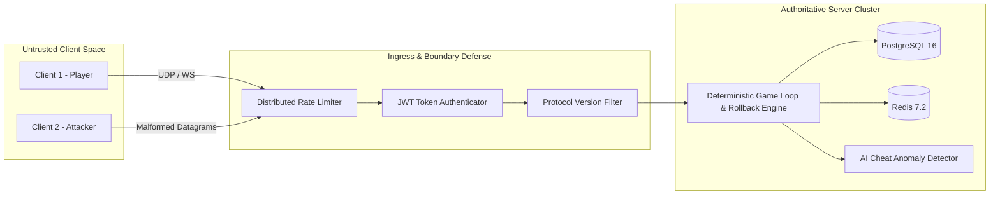

# Threat Model & Security Architecture: Rollback Netcode Server

## 1. System Assets & Trust Boundaries
- **Untrusted Zone**: Browser / Native Game Clients, public internet, unauthenticated REST/UDP endpoints.
- **DMZ / Gateway**: Load balancers, rate-limiting reverse proxies, WebSocket/UDP ingress ports.
- **Trusted Zone**: Authoritative Game Server runtime, Redis Cluster, PostgreSQL Database, ML inference workers.

## 2. STRIDE Threat Analysis & Defenses

| Threat Category | Specific Attack Vector | System Defense & Mitigation |
| :--- | :--- | :--- |
| **Spoofing** | Forging player ID or hijacking active UDP session | Ephemeral 32-bit session tokens assigned during authenticated handshake; validated per packet. |
| **Tampering** | Modifying client coordinates or health in memory | **Strict Server Authority**: client only sends input bitmasks; server calculates all physics and state transitions. |
| **Repudiation** | Denying illicit actions or match results | Append-only cryptographic audit logs and immutable match input replay logs in PostgreSQL. |
| **Information Disclosure** | Sniffing opponent inputs or backend infrastructure IPs | Ephemeral session tokens; no PII transmitted over UDP; match rooms allocated on isolated dynamic ports. |
| **Denial of Service** | Flooding game UDP port with spoofed packets | Token-bucket rate limiting per IP; early drop of packets with invalid magic headers or tokens before parsing. |
| **Elevation of Privilege** | Normal player invoking admin/moderation endpoints | Role-Based Access Control (RBAC) enforced via cryptographically signed JWT tokens with role claims (`ROLE_PLAYER`, `ROLE_ADMIN`). |

## 3. Protocol Security Rules
1. **Magic Header & Version Check**: Every packet must begin with `0x524E4331` (`RNC1`) and version `0x01`. Unsupported versions are dropped immediately.
2. **Payload Size Clamping**: Maximum UDP datagram size is clamped to 512 bytes; oversized datagrams are rejected without allocation.
3. **Bounded Resimulation Window**: Rollback is strictly capped at 128 frames to prevent CPU exhaustion attacks via artificially delayed packets.
